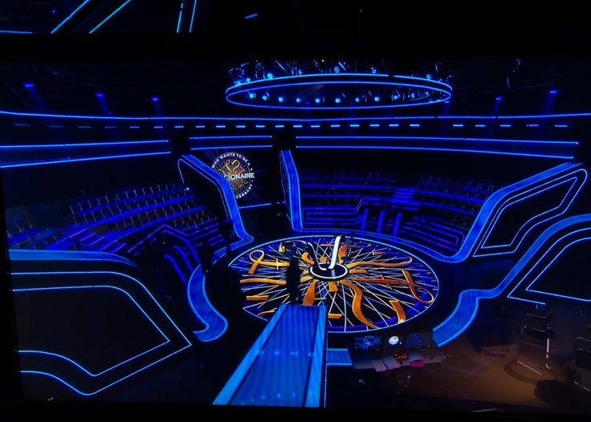

# Who Wants to Be a Millionaire? — Beer Edition

A "Who Wants to Be a Millionaire?" style quiz game built with React. Answer 15 beer-themed trivia questions correctly to win $1,000,000. Each question has a 30-second timer — run out of time or pick the wrong answer and the game ends.

## Demo



## Features

- 15 progressive trivia questions on beer and brewing
- 30-second countdown timer per question — resets on each new question
- Money pyramid sidebar highlighting your current level
- Animated answer feedback (correct = green, wrong = red)
- Sound effects on correct and wrong answers
- Enter your name on the start screen
- Shows total winnings when the game ends

## Tech Stack

- [React 19](https://react.dev/) (hooks: `useState`, `useEffect`, `useMemo`, `useRef`)
- [use-sound](https://github.com/joshwcomeau/use-sound) for audio feedback
- CSS animations for answer reveal

## Getting Started

### Prerequisites

- Node.js 16+
- npm or yarn

### Installation

```bash
git clone https://github.com/YOUR_USERNAME/millionaire-game.git
cd millionaire-game
npm install
```

### Run locally

```bash
npm start
```

Opens at [http://localhost:3000](http://localhost:3000).

### Build for production

```bash
npm run build
```

## Project Structure

```
src/
├── components/
│   ├── Start.jsx      # Name entry screen
│   ├── Timer.jsx      # 30-second countdown timer
│   └── Trivia.jsx     # Question + answer logic
├── sounds/
│   ├── correct.wav
│   └── wrong.wav
├── assets/
│   └── bg.jpg
├── App.jsx            # Game state, questions data, money pyramid
├── App.css
└── index.js
```

## How to Play

1. Enter your name and click **Start**
2. Read the question and click one of the four answers
3. Wait for the reveal animation — green means correct, red means wrong
4. Answer all 15 questions correctly to win $1,000,000
5. If time runs out or you answer incorrectly, the game ends showing your total winnings

## License

MIT
